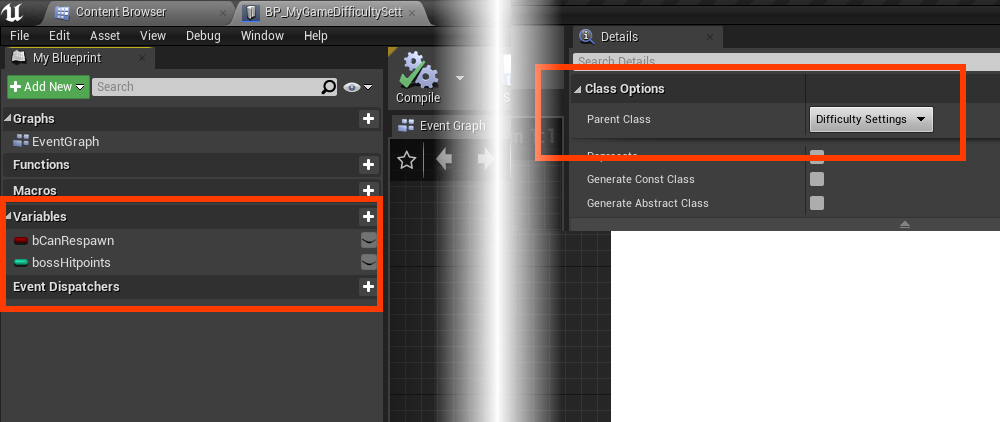
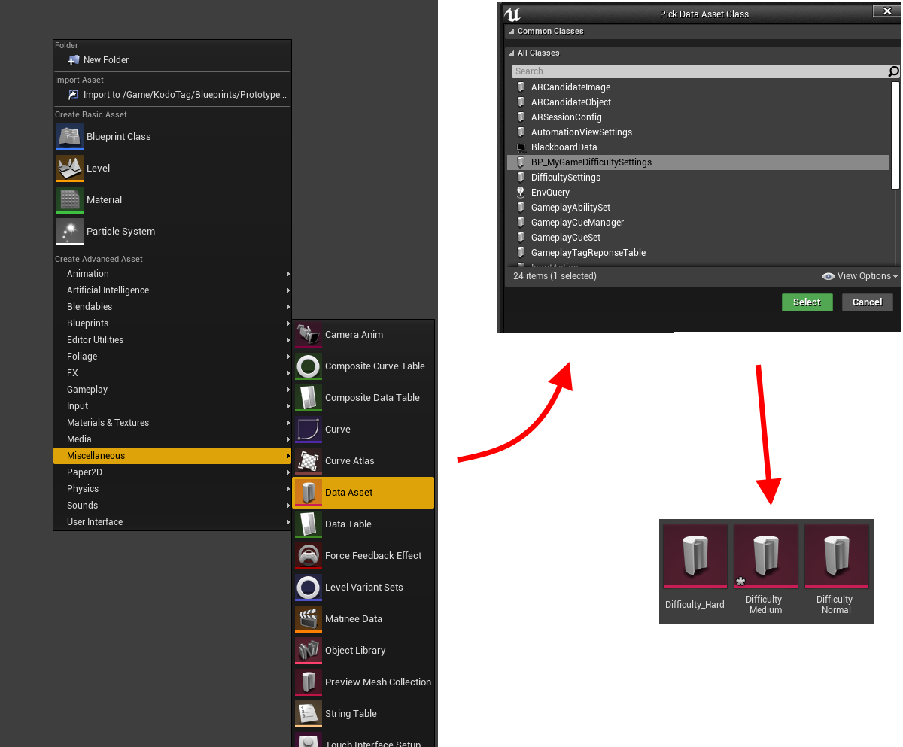
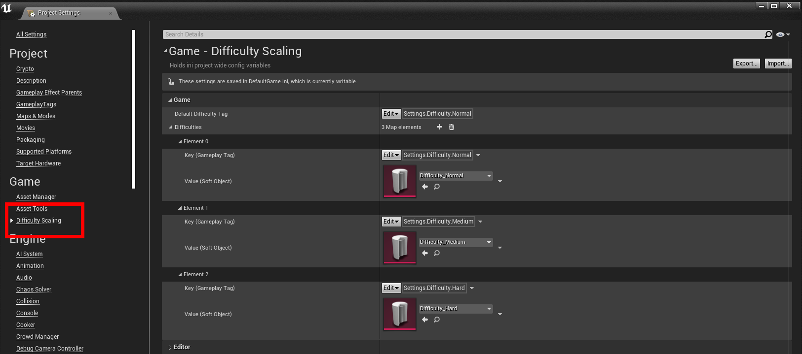
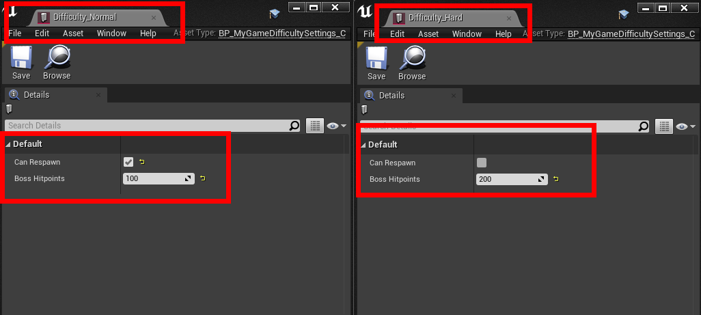
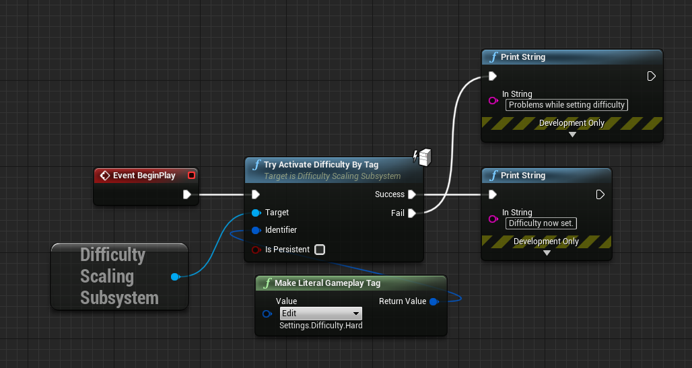
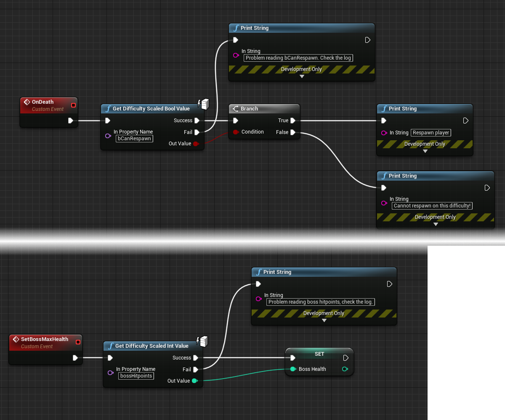
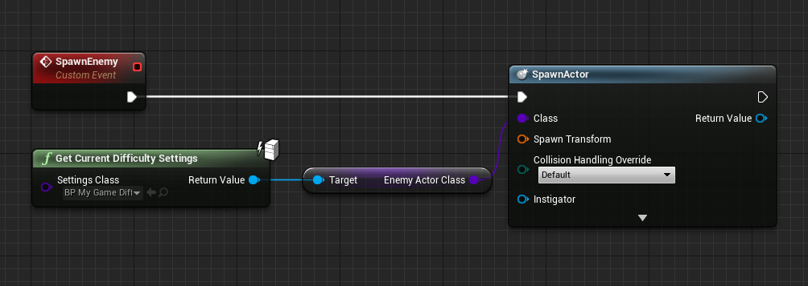
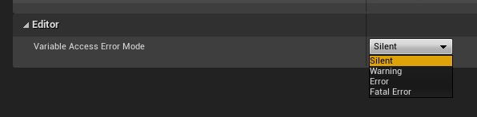

# Difficulty Scaling Plugin Documentation

This plugin is intended for games that have different difficulty levels, where the developers aim to manage and tweak variables centrally. It leverages the power of the DataAsset system and provides quick access to difficulty-influenced variables, often with only one or two blueprint nodes or C++ function calls.

## Getting Started
1. Activate the plugin in your Plugin Settings.

2. Inherit from UDifficultySettings, either with a C++ class or with a BP class.

3. Define variables that need to change based on difficulty level. Such as `bCanRespawn` and `bossHitPoints` in the example image.

> Hint: Set each variable to BlueprintReadOnly to prevent accidents where you modify your difficulty during gameplay.

4. Create a DataAsset for each difficulty level in your game that derives from your Settings class.

5. Configure your project settings to reflect the different difficulties available in your game. Identify each difficulty with a unique gameplay tag. 

6. Fill in the difficulty-scaled variables of your game. In the example, on hard difficulty you cannot respawn and the boss has more hitpoints.

7. By default, the difficulty is set based on the Default Difficulty value in the config. Use `TryActivateDifficultyByTag` in blueprint to change the difficulty during gameplay.

> Hint: Check `IsPersistent` to make this difficulty stick around when switching levels. Otherwise, the set difficulty will return to the default after a map-switch.

8. Use the quick-access nodes to get the difficulty-scaled variables in a single node. The output of this node automatically takes into account the currently set game difficulty.

> Hint: These quick-access nodes exist for Floats, Integers, Booleans and Texts.

9. For more complicated types, for which no quick-access nodes exist, you can use the more generic `GetCurrentDifficultySettings` and get full blueprint access to any variable inside the current difficulty data asset.

## Responding to changed difficulty
The `DifficultyScalingSubsystem` exposes the `OnDifficultyChanged` delegate to both C++ and BP. It returns the gameplay tags of the previous and current difficulties, along with their full settings asset and information about the persistence of the current difficulty. Use this delegate to react to difficulty changes in your game, for example in your user interface.

## Console command to change difficulty
The `DifficultyScalingSubSystem` exposes a console command to change the game difficulty. Use `ForceGameDifficulty <int>` in your console to change the difficulty during gameplay. The first argument expects a number, corresponding to a given index of the difficulties map in the project settings. This console command is not available in `SHIPPING` builds.

## Directly set the difficulty level without project setting configuration
It is possible to directly set the game difficulty based on a data asset, without configuring that difficulty in your project settings. This is not the recommended workflow, as it will reduce the amount of useful information in the `OnDifficultyChanged` event and the difficulty will not be available through the command line cheat `ForceGameDifficulty`. However, in niche situations, this may come in handy. Use `TryActivateDifficultyByAsset` to directly activate a game difficulty without adding that difficulty to your project configuration.

## Persistence
### Play-session persistence
The plugin supports persisting a chosen difficulty through the whole lifetime of the current playing session. To persist a chosen difficulty, set `IsPersistent` to true when calling `TryActivateDifficultyByAsset` or `TryActivateDifficultyByTag`. This will ensure the difficulty stays active even across map switches. When `IsPersistent` is set to false, the chosen difficulty will be reset to the configured (project settings) default when a new world is loaded. This can be useful in match-based games where a new difficulty is chosen every new match. Most other games will want to remember the difficulty choice and thus select `IsPersistent = true`.
### Persistence across sessions.
The plugin does **not** support saving the chosen difficulty across game shutdown and reboot. It is up to the game logic to save and load the correct difficulty when it is appropriate in the flow of the game. This means if the game does not implement its own savegame logic, the difficulty will be set to the configured (project settings) default every time the game is rebooted.

## Multiplayer 
The functionality of the plugin only works in singleplayer games, or multiplayer games with server authority. This aligns with the UE multiplayer model of authorative servers. It is up to the server to propagate the correct information to clients, since the clients do not have access to the difficulty information. All the functions exposed to blueprint are marked `BlueprintAuthorityOnly`, meaning they will not run on clients. **Client logic should not in any way rely on difficulty information**.

## Changing error severity
The functions `GetDifficultyScaledFloatValue`, `GetDifficultyScaledIntValue`, `GetDifficultyScaledBoolValue` and `GetDifficultyScaledTextValue` all require a string-based lookup of the variable name in the difficulty settings.
During development, those variables may get renamed or even removed. These nodes need to be updated accordingly when that happens. 
There are several error modes available in `Project Settings -> Game -> Difficulty Scaling` to change the behaviour of the handling of errors. Regardless of error mode, in blueprint, the Fail output pin will fire.
* Silent: Fire the "Fail" blueprint pin, but nothing else
* Warning: Fire the "Fail" blueprint pin + Print a Warning to the log
* Error: Fire the "Fail" blueprint pin + Print an error to the log
* FatalError: Fire the "Fail" blueprint pin + Print an error to the log and trigger a breakpoint.

